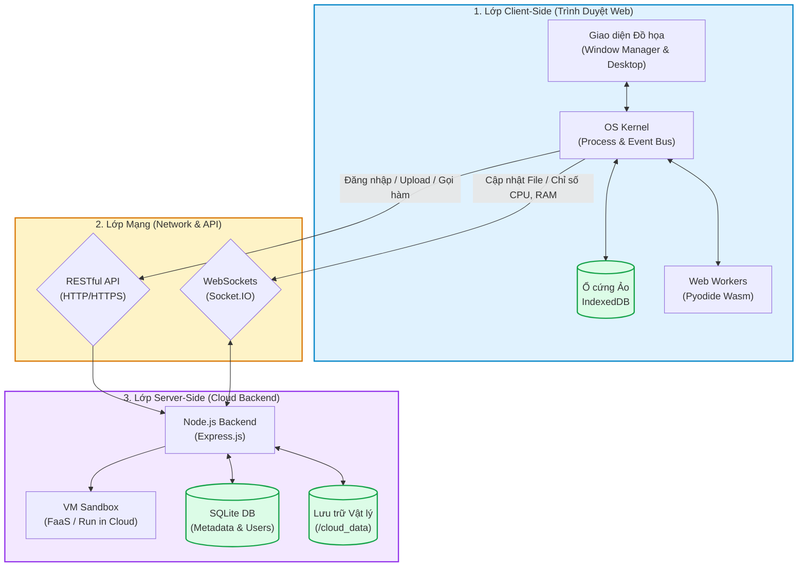

# Báo Cáo Kiến Trúc Hệ Thống Chuyên Sâu: NexOS - Cloud Computing Web OS

## Lời Nói Đầu & Tầm Nhìn Dự Án
Trong kỷ nguyên số hóa, nhu cầu làm việc linh hoạt, không phụ thuộc vào thiết bị phần cứng cụ thể ngày càng tăng cao. **NexOS** ra đời nhằm giải quyết bài toán đó bằng cách mang toàn bộ trải nghiệm của một Hệ điều hành (Operating System) lên trình duyệt Web. Kết hợp sức mạnh của **Điện toán Đám mây (Cloud Computing)** và **Công nghệ Web hiện đại (WebAssembly, WebSockets, IndexedDB)**, NexOS không chỉ là một giao diện giả lập mà là một môi trường làm việc thực thụ theo mô hình **Desktop-as-a-Service (DaaS)**. Người dùng có thể lưu trữ, lập trình, và giám sát tài nguyên mà không cần bận tâm đến hệ điều hành vật lý bên dưới.

---

## 1. Kiến Trúc Tổng Thể Hệ Thống (System Architecture)
Hệ thống NexOS được thiết kế theo kiến trúc **Client-Server 3 Lớp (3-Tier Architecture)** kết hợp với mô hình **Event-Driven (Hướng sự kiện)**:

1.  **Lớp Trình Bày & Xử Lý Khách (Client-Side / Frontend):**
    *   Đóng vai trò là toàn bộ Giao diện Hệ điều hành (GUI).
    *   Sở hữu một **Kernel (Nhân hệ điều hành) mô phỏng** viết bằng Javascript để quản lý tiến trình (Process Manager), quản lý cửa sổ (Window Manager), và hệ thống sự kiện (Event Bus).
    *   Quản lý bộ nhớ lưu trữ cục bộ bằng Hệ thống File ảo (Virtual File System - VFS).
2.  **Lớp Giao Tiếp (Network & API Layer):**
    *   Sử dụng **RESTful API** (HTTP/HTTPS) cho các giao dịch trạng thái (Stateless) như Đăng nhập, Tạo tài khoản, Upload/Download file, và gọi hàm Serverless.
    *   Sử dụng **WebSockets** (giao thức TCP hai chiều liên tục) cho các giao dịch thời gian thực (Real-time) như giám sát tài nguyên máy chủ (telemetry) và thông báo đồng bộ file.
3.  **Lớp Dịch Vụ Đám Mây & Lưu Trữ (Server-Side / Backend):**
    *   Hoạt động như một Đám mây trung tâm (Centralized Cloud).
    *   Chịu trách nhiệm bảo mật (Authentication & Authorization), quản lý Multi-tenancy (Đa khách hàng).
    *   Cung cấp sức mạnh tính toán (FaaS) và lưu trữ vật lý dai dẳng (Persistent Storage).

---

## 2. Các Công Nghệ Cốt Lõi Và Phân Tích Kỹ Thuật

### 2.1. Lớp Frontend (Client-Side)
Thay vì sử dụng các framework cồng kềnh như React hay Vue, NexOS được xây dựng hoàn toàn bằng **Vanilla HTML5, CSS3, và JavaScript**. 
*   **Ý nghĩa kỹ thuật:** Việc dùng Vanilla JS giúp hệ thống có toàn quyền can thiệp vào cấp độ thấp của DOM (Document Object Model), từ đó tối ưu hóa tối đa hiệu năng render cho trình quản lý cửa sổ (Window Manager) - nơi đòi hỏi việc tính toán tọa độ z-index, kéo thả (drag & drop) liên tục mà không bị nghẽn bởi Virtual DOM của các framework.
*   **IndexedDB (Virtual File System - VFS):** Hệ điều hành web cần một ổ cứng. Thay vì dùng `localStorage` (giới hạn 5MB và chỉ lưu chuỗi), NexOS dùng `IndexedDB` vì đây là cơ sở dữ liệu NoSQL bất đồng bộ (Asynchronous) tích hợp sẵn trong trình duyệt. Nó cho phép lưu trữ hàng trăm MB dữ liệu, hỗ trợ lưu cả file nhị phân (Blob/Buffer), và không làm đơ (block) giao diện chính (Main Thread) khi thao tác đọc/ghi file lớn.
*   **WebAssembly (Wasm) & Web Workers:** Công nghệ đột phá cho phép đem mã C/C++ biên dịch chạy trực tiếp trên trình duyệt với tốc độ gần bằng native. NexOS dùng nó để chạy môi trường Python. `Web Workers` được sử dụng để đẩy các tác vụ nặng (như chạy code Python) ra một luồng xử lý nền (Background Thread), giúp giao diện OS luôn mượt mà.

### 2.2. Lớp Backend (Server-Side)
*   **Node.js & Express.js:** Sự lựa chọn hoàn hảo cho hệ thống I/O-intensive (nhiều thao tác đọc/ghi file và mạng). Kiến trúc Event-Loop đơn luồng của Node.js xử lý cực kỳ xuất sắc hàng ngàn kết nối WebSockets đồng thời mà tốn rất ít RAM.
*   **Socket.IO:** Thư viện trừu tượng hóa WebSockets, tự động xử lý fallback (chuyển đổi giao thức nếu mạng lỗi) và tự động kết nối lại (auto-reconnect), đảm bảo trải nghiệm Đám mây không bị gián đoạn.
*   **SQLite:** Cơ sở dữ liệu quan hệ (RDBMS) siêu nhẹ, lưu trữ dạng file đính kèm. Phù hợp để lưu siêu dữ liệu (metadata) như danh sách tài khoản, mật khẩu (đã băm bằng Bcrypt), và bảng phân quyền chia sẻ file (Shared Files). Giúp Backend cực kỳ dễ dàng triển khai mà không cần cài đặt thêm Database Server rời (như MySQL/PostgreSQL).
*   **Docker Containerization:** Toàn bộ Backend được đóng gói thành Docker Image. Ý nghĩa: Đảm bảo tính nhất quán của môi trường chạy, dễ dàng scale (mở rộng) khi lượng truy cập tăng, và cô lập hoàn toàn hệ thống NexOS với hệ điều hành của máy chủ vật lý.

---

## 3. Ứng Dụng Mô Hình Điện Toán Đám Mây (Cloud Computing)

Dự án NexOS không chỉ là "Web", mà là một minh chứng của "Cloud" với 4 trụ cột kiến trúc:

### 3.1. Cloud Storage & Sync Engine (Mô hình PaaS / SaaS)
*   **Ý nghĩa:** Cung cấp giải pháp lưu trữ phi tập trung và an toàn, giải quyết bài toán mất dữ liệu khi người dùng xóa cache trình duyệt.
*   **Cơ chế Kỹ thuật:** Module `cloud.js` (Client) liên tục theo dõi sự thay đổi (Event Watcher) trong thư mục ảo `/cloud`. Khi có thao tác Tạo/Sửa/Xóa file, một "Sync Queue" (Hàng đợi đồng bộ) sẽ gom các tác vụ lại và đẩy lên Server. Server nhận file, lưu vào thư mục định tuyến riêng của người dùng (Multi-tenancy). 
*   **Giá trị gia tăng:** Hỗ trợ **Version History** (Lịch sử phiên bản) - mỗi lần lưu file, hệ thống giữ lại bản sao cũ, cho phép khôi phục khi lỗi. Hỗ trợ **File Sharing** - cho phép cấp quyền truy cập file chéo giữa các tài khoản người dùng khác nhau trên cùng hệ thống.

### 3.2. Serverless Execution (Function as a Service - FaaS)
*   **Ý nghĩa:** Tính năng **"Run in Cloud"** cho phép NexOS vượt khỏi giới hạn sức mạnh tính toán của thiết bị cá nhân (ví dụ: một chiếc điện thoại yếu vẫn có thể chạy thuật toán trí tuệ nhân tạo nặng).
*   **Cơ chế Kỹ thuật:** Khi người dùng chạy lệnh, mã nguồn được gửi lên Backend. Tại đây, Node.js dùng module `vm` (Virtual Machine) để khởi tạo một Sandbox (Hộp cát) bị giới hạn quyền truy cập hệ thống. Mã được biên dịch và chạy trong Sandbox đó, sau đó hệ thống thu gom luồng đầu ra (`stdout/stderr`) gửi ngược về Frontend.
*   **Ưu điểm:** Khách hàng không cần thuê hay cấu hình máy chủ, chỉ cần gửi Code và nhận Kết quả.

### 3.3. Multi-Tenancy & Security (Kiến trúc Đa Khách Hàng)
*   **Cơ chế Kỹ thuật:** Sử dụng kiến trúc Stateless Authentication với **JSON Web Token (JWT)**. Server không lưu trạng thái đăng nhập, thay vào đó cấp phát một mã Token mã hóa. Mỗi request gọi lên Đám mây đều phải đính kèm Token này. Middleware của Backend sẽ giải mã Token, xác định ID người dùng, từ đó định tuyến chính xác yêu cầu đọc/ghi vào đúng thư mục vật lý của người đó, đảm bảo các tenant (người dùng) bị cô lập hoàn toàn.

### 3.4. Cloud Telemetry & Observability (Giám sát Hệ thống)
*   Bảng điều khiển của hệ thống nhận luồng stream dữ liệu liên tục từ Server qua WebSockets (thông tin CPU Model, Số lượng Core, RAM đang tiêu thụ). Điều này biến NexOS thành một trạm kiểm soát (Control Panel) thực thụ để người quản trị nắm bắt sức khỏe của hạ tầng Đám mây.

---

## 4. Phân Tích Ý Nghĩa Xây Dựng Các Ứng Dụng Tích Hợp (Built-in Apps)

Hệ sinh thái ứng dụng trong NexOS không chỉ để "cho có", mà mỗi App đều trình diễn một kỹ thuật cốt lõi của Hệ điều hành:

### 4.1. File Explorer & Cloud Drive (Trình quản lý tệp tin)
*   **Ý nghĩa xây dựng:** Cung cấp GUI (Giao diện đồ họa) để con người có thể tương tác với Virtual File System (vốn chỉ là các byte dữ liệu vô hình trong IndexedDB) và Cloud Storage.
*   **Kỹ thuật nổi bật:** Thuật toán duyệt cây thư mục (Directory Tree Traversal), hệ thống Context Menu (chuột phải động tùy theo loại file), quản lý Thùng rác (Recycle Bin logic - di chuyển con trỏ dữ liệu thay vì xóa vật lý), và thuật toán hiển thị trạng thái đồng bộ (Synced/Pending).

### 4.2. Terminal (Cửa sổ dòng lệnh `nexsh`)
*   **Ý nghĩa xây dựng:** Mang lại công cụ mạnh mẽ dành cho Power Users và Developer. Nó chứng minh rằng File System ảo có khả năng tương tác ở mức độ lệnh (Command Line Interface) chứ không chỉ qua đồ họa.
*   **Kỹ thuật nổi bật:** Trình phân tích cú pháp lệnh (Command Parser). Xây dựng cơ chế mô phỏng (Mocking) các lệnh Linux kinh điển: `ls` (đọc VFS), `cd` (thay đổi state current_path), `cp/mv` (thao tác luồng dữ liệu file). Đặc biệt là khả năng bắt sự kiện bàn phím (Arrow keys cho History, Tab cho Auto-complete).

### 4.3. NexNotebook (Môi trường Khoa học Dữ liệu - Python REPL)
*   **Ý nghĩa xây dựng:** Trình diễn sức mạnh của **Edge Computing** (Điện toán biên) và WebAssembly. Thay vì đưa Python lên Server gây tốn kém tài nguyên (như cách Google Colab làm), NexNotebook mang lõi Python xuống tận thiết bị của người dùng.
*   **Kỹ thuật nổi bật:** Quản lý giao diện Đa khối (Multi-cell UI) cho phép xen kẽ mã nguồn và kết quả. Giao tiếp bất đồng bộ qua message passing (`postMessage`) giữa giao diện chính (Main DOM) và `pyodide-worker.js` (Web Worker). Hỗ trợ chụp chặn luồng in tiêu chuẩn (`sys.stdout`) của Python Wasm để render trực tiếp lên màn hình web.

### 4.4. Task Manager (Trình Quản Lý Tác Vụ)
*   **Ý nghĩa xây dựng:** Mang lại khả năng Observability (Quan sát) cho Hệ điều hành.
*   **Kỹ thuật nổi bật:** Theo dõi bộ nhớ JS Heap, thu thập danh sách tiến trình từ Window Manager, tích hợp dữ liệu WebSockets từ Server để vẽ biểu đồ tài nguyên bằng DOM manipulation linh hoạt. Khả năng "End Task" (Giết tiến trình) can thiệp thẳng vào hệ thống quản lý bộ nhớ của Client.

---

## 5. Tổng Kết
Dự án NexOS không đơn thuần là một website có giao diện bắt mắt. Nó là một giải pháp kiến trúc phần mềm phức tạp, đan xen giữa nguyên lý thiết kế **Hệ Điều Hành cơ bản** (File System, Window Management, Process) và các mô hình **Điện Toán Đám Mây hiện đại** (Serverless, Cloud Storage, JWT Multi-tenancy). 

Thông qua việc tận dụng triệt để năng lực của các API Web thế hệ mới (Wasm, IndexedDB, Web Workers), NexOS đã thu hẹp khoảng cách giữa ứng dụng Web và ứng dụng Desktop nguyên bản (Native App). Dự án cung cấp một khuôn khổ (framework) tiềm năng cho tương lai của làm việc từ xa, môi trường giáo dục lập trình, hoặc các hệ thống Workspaces dùng chung cho doanh nghiệp.
