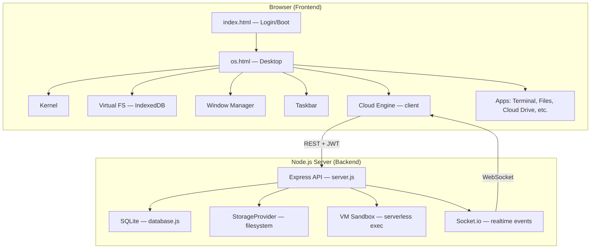

# NexOS Cloud Improvement Analysis

> A comprehensive audit of the current codebase to identify what would make this Web OS a more authentic **cloud-computing** project.

---

## Current Architecture Summary



**What you already have (and it's solid):**
- JWT auth with bcrypt hashing & rate limiting
- Real server-backed file storage with SQLite metadata
- WebSocket-based real-time sync notifications
- Per-user storage quota enforcement (5 GB)
- RBAC (Administrator, Cloud Operator, Standard User)
- Sandboxed serverless JS execution (vm module)
- Full virtual filesystem with IndexedDB
- Dockerized deployment

---

## 🔴 1. Security Gaps (High Priority)

These are issues that would be flagged in any cloud computing security audit.

### 1.1 Hardcoded JWT Secret
**File:** [server.js](file:///d:/Web%20Os/server.js#L12)
```js
const JWT_SECRET = process.env.JWT_SECRET || 'nexos-cloud-secret-key-change-in-production';
```
> [!CAUTION]
> The fallback secret is predictable. In production this would allow anyone to forge JWT tokens. Remove the fallback entirely and require `JWT_SECRET` as a mandatory environment variable.

### 1.2 Default Credentials Shipped in Code
**File:** [database.js](file:///d:/Web%20Os/database.js#L58-L60)
```js
await db.run('INSERT ...', ['admin', bcrypt.hashSync('nexos', ...), 'Administrator']);
await db.run('INSERT ...', ['user', bcrypt.hashSync('password', ...), 'Standard User']);
await db.run('INSERT ...', ['cloud', bcrypt.hashSync('cloud123', ...), 'Cloud Operator']);
```
> [!WARNING]
> Three accounts with weak, publicly known passwords. A real cloud platform would force first-run password setup or generate random initial credentials logged to the console.

### 1.3 No Input Sanitization on File Paths
**File:** [server.js](file:///d:/Web%20Os/server.js#L114-L115)
```js
const metaKey = `${req.user}:${clientPath}`;
const fileId = Buffer.from(metaKey).toString('base64').replace(/=/g, '');
```
> [!WARNING]
> `clientPath` comes directly from the request body with no validation. A user could craft paths like `../../etc/passwd` or inject special characters. Add path traversal guards.

### 1.4 CORS Wide Open
```js
app.use(cors()); // Allows ANY origin
io = new Server(server, { cors: { origin: '*' } });
```
> [!IMPORTANT]
> Real cloud platforms restrict CORS to known origins. Set explicit allowed origins or derive them from configuration.

### 1.5 No HTTPS Enforcement
The Docker setup serves over plain HTTP. Cloud platforms mandate TLS. Add nginx as a reverse proxy with Let's Encrypt, or enforce HTTPS headers.

### 1.6 No Audit Logging
There's no record of who logged in, who deleted what, or who executed code. Cloud computing platforms provide audit trails as a first-class feature.

---

## 🟠 2. Architecture — Simulated vs. Real (Medium-High Priority)

Several features *appear* to be cloud features but are actually simulated. This is the single biggest gap.

### 2.1 Fake Network Statistics
**File:** [cloud.js](file:///d:/Web%20Os/js/cloud.js#L284-L291)
```js
_startNetworkSimulation() {
    setInterval(() => {
        state.networkStats.up   = Math.floor(Math.random() * 512);   // ← random noise
        state.networkStats.down = Math.floor(Math.random() * 1024);  // ← random noise
    }, 2000);
}
```
> [!IMPORTANT]
> **Improvement:** Track actual `fetch()` payload sizes during sync operations. You're already tracking `state.networkStats.totalUp` from real uploads — extend this to also measure real instantaneous rates instead of random noise.

### 2.2 Fake CPU/Memory Metrics
**File:** [kernel.js](file:///d:/Web%20Os/js/kernel.js#L64-L65)
```js
getMemUsage(){ return Math.floor(20 + Math.random() * 15); }, // Simulated %
getCpuUsage(){ return Math.floor(3 + Math.random() * 12);  }  // Simulated %
```
> **Improvement:** Use the [Performance API](https://developer.mozilla.org/en-US/docs/Web/API/Performance/memory) for real JS heap stats, and `performance.now()` deltas to estimate real CPU load. On the server side, expose `/api/system/metrics` using `os.cpuUsage()`, `process.memoryUsage()`, and `os.freemem()`.

### 2.3 Fake Server/VM List
**File:** [cloud.js](file:///d:/Web%20Os/js/cloud.js#L20-L25)
```js
const SERVERS = [
    { id: 'nexos-vm-01', ... cores: 4, ram: '8 GB', status: 'online' },
    // ... hardcoded
];
```
> **Improvement:** Create a real `/api/cloud/servers` endpoint that returns actual container status from Docker. You already mount the Docker socket (`/var/run/docker.sock`) in docker-compose — query it to list running containers as "VMs."

### 2.4 Simulated SSH
**File:** [terminal.js](file:///d:/Web%20Os/js/apps/terminal.js#L324-L332)
```js
case 'ssh': {
    await new Promise(r => setTimeout(r, 800 + Math.random()*600));  // fake delay
    print(`Connected to ${server.id}...`);  // cosmetic text
}
```
> **Improvement:** Make `ssh <server-id>` actually spin up a container (via Docker API) and open a WebSocket-backed PTY session, or at minimum provide a real interactive terminal session to the server via Socket.io.

### 2.5 Region Selection Does Nothing Real
Changing the region only changes a latency number used to add `setTimeout()` delays. No actual data routing changes.

> **Improvement:** If multi-region isn't feasible, at least make the region affect the server endpoint URL (e.g., different ports or container instances for different "regions"). This makes it a meaningful architectural concept.

---

## 🟡 3. Missing Cloud Computing Features (Medium Priority)

Features that real cloud platforms offer and would significantly elevate this project.

### 3.1 No File Versioning
When a file is re-uploaded, the previous version is overwritten with no history.

> **Improvement:** Add a `file_versions` table in SQLite. On each upload, preserve the old `fileId` as a version. Add a "Version History" option in the Cloud Drive context menu to view/restore past versions.

### 3.2 No File Sharing Between Users
Standard Users have zero ability to share files with other users. Admins can *see* all files, but there's no selective sharing.

> **Improvement:** Add a `shared_files` table mapping `(owner, path, shared_with_user, permission)`. Add "Share with..." to the context menu. This is a core cloud storage feature (think Google Drive, Dropbox).

### 3.3 No Activity Dashboard / Monitoring
Cloud platforms have dashboards showing request counts, error rates, storage trends over time.

> **Improvement:** Log API requests to a `request_log` table (timestamp, user, endpoint, status code, response time). Build a dashboard app or add a tab to Task Manager showing real-time request rates and historical trends.

### 3.4 No Container/Function Management
The serverless execution is fire-and-forget with no history.

> **Improvement:** 
> - Log each execution to a `function_executions` table (user, code hash, input, output, duration, memory used)
> - Show execution history in the Cloud Drive or a new "Functions" app
> - Allow naming and saving cloud functions for re-use

### 3.5 No Storage Tiering / Object Lifecycle
Everything is stored in a flat directory. Cloud platforms have hot/cold/archive tiers.

> **Improvement:** Add metadata fields like `storage_class: 'standard' | 'archive'`. Files in `/cloud/backup` could be auto-classified as "archive" with simulated lower costs. This teaches cloud storage concepts.

### 3.6 No Resource Quotas Beyond Storage
There's a 5 GB storage limit, but no limits on:
- Number of API requests per minute
- Serverless execution time or invocations
- Number of concurrent WebSocket connections

> **Improvement:** Add rate limiting middleware (`express-rate-limit`) and track per-user quotas for compute and requests, not just storage.

### 3.7 No Billing / Usage Tracking
Real cloud platforms meter everything.

> **Improvement:** Track "cloud credits" — each upload, download, and function execution costs a fractional amount. Show a usage & billing page in Settings. This teaches cloud cost management.

---

## 🟢 4. Scalability & Production Readiness (Medium-Low Priority)

### 4.1 Single-Process Architecture
The entire backend is a single `server.js`. If it crashes, everything goes down.

> **Improvement:**
> - Add `pm2` or `node:cluster` for process management
> - Add health check endpoint (`GET /api/health`)
> - Add graceful shutdown handling

### 4.2 No Database Connection Pooling
SQLite is fine for a demo, but a real cloud platform would use PostgreSQL or at minimum WAL mode.

> **Improvement:** Enable SQLite WAL mode for concurrent reads:
> ```js
> await db.exec('PRAGMA journal_mode=WAL');
> ```

### 4.3 No API Versioning
All endpoints are `/api/cloud/*`. Breaking changes would affect all clients.

> **Improvement:** Prefix routes with `/api/v1/cloud/*`.

### 4.4 No Request Logging / Structured Logging
Only `console.log` is used. No structured log format, no log levels.

> **Improvement:** Use `winston` or `pino` with JSON output. Include request ID, user, timestamp, and duration in every log line.

### 4.5 Static Files Served from App Server
```js
app.use(express.static(__dirname, { index: 'index.html' }));
```
> This serves the entire working directory, including `server.js`, `database.js`, `node_modules`, etc.

> [!CAUTION]
> **Anyone can download your server source code** at `http://host:8080/server.js`. Restrict static serving to only `css/`, `js/`, `index.html`, and `os.html`.

---

## 🔵 5. DevOps & Infrastructure (Low-Medium Priority)

### 5.1 No CI/CD Pipeline
No GitHub Actions, no automated testing, no deployment automation.

> **Improvement:** Add a `.github/workflows/ci.yml` that runs linting and any tests on push.

### 5.2 No Environment Configuration Management
```yml
# docker-compose.yml
environment:
    - PORT=8080
    - NODE_ENV=production
    # Missing: JWT_SECRET, DB_PATH, LOG_LEVEL, etc.
```
> **Improvement:** Create a `.env.example` documenting all required environment variables. Use `dotenv` in development.

### 5.3 No Docker Health Check
The Docker container has no health check defined.

> **Improvement:**
> ```dockerfile
> HEALTHCHECK --interval=30s --timeout=5s \
>   CMD wget -q --spider http://localhost:8080/api/health || exit 1
> ```

### 5.4 No Multi-Stage Docker Build
The current Dockerfile copies everything including `cloud_data`. 

> **Improvement:** Use a multi-stage build to reduce image size and avoid shipping development files.

---

## 🟣 6. UX / Cloud Experience Polish

### 6.1 No Real File Upload from Local Machine
The "Upload" button in Cloud Drive just prompts for a filename and generates placeholder content. There's no ability to drag-and-drop or browse local files.

> **Improvement:** Add a real `<input type="file">` and drag-and-drop zone. Read the file with `FileReader` and upload the actual content.

### 6.2 No File Download to Local Machine
The "Download" button saves to the virtual FS, not to the user's real disk.

> **Improvement:** Add a "Download to Computer" option that creates a `Blob` and triggers a real browser download via `URL.createObjectURL()`.

### 6.3 Terminal `ssh` and `ping` Are Purely Cosmetic
They simulate delays and print static text. No real network interaction.

### 6.4 No Multi-Tab / Multi-Instance for Terminal
You can only open one Terminal window. Cloud engineers need multiple terminals.

> **Improvement:** Remove the singleton check (`if (WebOS.WindowManager.isOpen(id))`) and generate unique window IDs per instance.

---

## 🔶 7. Code Quality

### 7.1 Escaped Newlines in Serverless Execution
**File:** [server.js](file:///d:/Web%20Os/server.js#L276-L278)
```js
res.json({ success: true, logs: logs.join('\\\\n') });
```
> [!WARNING]
> This is double-escaped. The output will literally show `\\n` instead of actual newlines. Should be `logs.join('\\n')`.

### 7.2 Build Stamp Is Stale
**File:** [settings.js](file:///d:/Web%20Os/js/apps/settings.js#L394)
```js
['Build', 'cloud-2024.04.14'],
```
> Hardcoded to April 2024. Either auto-generate from git commit or `Date.now()` at build time.

### 7.3 No Error Boundaries
If any app crashes (throws an unhandled error), the entire desktop can become unresponsive. Add `try/catch` wrappers around app `launch()` callbacks and `window.onerror` / `window.onunhandledrejection` handlers.

---

## Priority Summary

| Priority | Category | Impact | Effort |
|----------|----------|--------|--------|
| 🔴 **Critical** | Static file exposure (§4.5) | Anyone can download `server.js` | 5 min |
| 🔴 **Critical** | JWT secret hardcoded (§1.1) | Token forgery risk | 5 min |
| 🔴 **High** | Path traversal (§1.3) | Arbitrary file access | 30 min |
| 🔴 **High** | Double-escaped newlines (§7.1) | Broken serverless output | 5 min |
| 🟠 **High** | Real metrics instead of random (§2.1-2.2) | Authenticity | 2-3 hrs |
| 🟠 **High** | Real Docker server status (§2.3) | Authenticity | 1-2 hrs |
| 🟡 **Medium** | File versioning (§3.1) | Core cloud feature | 3-4 hrs |
| 🟡 **Medium** | File sharing (§3.2) | Core cloud feature | 4-5 hrs |
| 🟡 **Medium** | Real file upload/download (§6.1-6.2) | Usability | 1-2 hrs |
| 🟡 **Medium** | Audit logging (§1.6, §3.3) | Cloud compliance | 2-3 hrs |
| 🟡 **Medium** | Resource quotas & billing (§3.6-3.7) | Cloud concepts | 3-4 hrs |
| 🟢 **Low** | Health checks, API versioning (§4.1-4.3) | Production readiness | 1-2 hrs |
| 🟢 **Low** | CI/CD, Docker improvements (§5) | DevOps maturity | 2-3 hrs |
| 🔵 **Nice-to-have** | Multi-terminal, cosmetic fixes (§6.4, §7.2) | Polish | 1 hr |

---

## Recommended Next Steps

If you want to turn this from a "Web OS with cloud sync" into a "cloud computing platform", I'd tackle these in order:

1. **Fix the critical security holes** (§4.5, §1.1, §1.3, §7.1) — 1 hour total
2. **Replace fake metrics with real data** (§2.1, §2.2) — gives instant credibility  
3. **Add file versioning** (§3.1) — the single most impactful cloud feature to add
4. **Add real file upload/download** (§6.1, §6.2) — makes it actually usable
5. **Add audit logging & monitoring dashboard** (§1.6, §3.3) — makes it feel like a real cloud console
6. **Add usage/billing tracking** (§3.7) — teaches cloud cost concepts

> [!TIP]
> Would you like me to implement any of these improvements? I can start with the critical security fixes and work through the priority list, or focus on a specific area you're most interested in.
