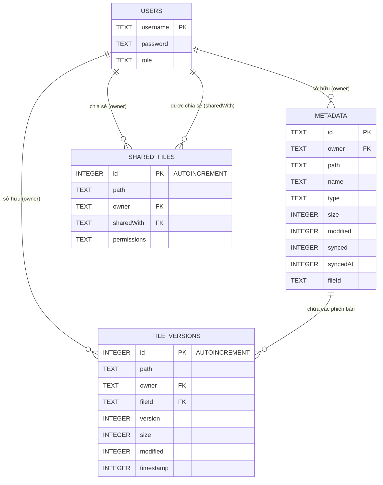

# Sơ Đồ Cơ Sở Dữ Liệu (Database Schema)

Dưới đây là sơ đồ cơ sở dữ liệu cho hệ thống NexOS Cloud Web OS, được phân tích dựa trên file cấu trúc SQLite `database.js`.

## Sơ Đồ Quan Hệ Thực Thể (ER Diagram)

## Chi Tiết Các Bảng (Tables)

### Bảng `users`
Lưu trữ thông tin người dùng và quyền hạn của họ trong hệ thống.

| Cột | Kiểu dữ liệu | Ràng buộc | Mô tả |
|---|---|---|---|
| `username` | TEXT | PRIMARY KEY | Tên đăng nhập của người dùng. |
| `password` | TEXT | NOT NULL | Mật khẩu (được băm bảo mật bằng bcrypt). |
| `role` | TEXT | NOT NULL | Vai trò của người dùng (ví dụ: Administrator, Standard User, Cloud Operator). |

### Bảng `metadata`
Lưu trữ siêu dữ liệu (metadata) của các file trong hệ thống tập tin đám mây.

| Cột | Kiểu dữ liệu | Ràng buộc | Mô tả |
|---|---|---|---|
| `id` | TEXT | PRIMARY KEY | ID định danh duy nhất cho siêu dữ liệu. |
| `owner` | TEXT | NOT NULL | Tên người sở hữu (tham chiếu tới `users.username`). |
| `path` | TEXT | NOT NULL | Đường dẫn tuyệt đối của file trên hệ thống tập tin ảo. |
| `name` | TEXT | NOT NULL | Tên file. |
| `type` | TEXT | NOT NULL | Loại file (mime-type, ví dụ: thư mục, text, hình ảnh). |
| `size` | INTEGER | DEFAULT 0 | Kích thước file (bytes). |
| `modified` | INTEGER | | Thời gian chỉnh sửa cuối cùng (timestamp). |
| `synced` | INTEGER | DEFAULT 1 | Cờ đánh dấu trạng thái đồng bộ lên đám mây. |
| `syncedAt` | INTEGER | | Thời gian đồng bộ thành công cuối cùng. |
| `fileId` | TEXT | NOT NULL | ID của file vật lý tương ứng trên hệ thống đám mây. |

### Bảng `file_versions`
Theo dõi các phiên bản lịch sử của file để hỗ trợ tính năng phục hồi (version history).

| Cột | Kiểu dữ liệu | Ràng buộc | Mô tả |
|---|---|---|---|
| `id` | INTEGER | PRIMARY KEY AUTOINCREMENT | ID duy nhất định danh một phiên bản. |
| `path` | TEXT | NOT NULL | Đường dẫn file tương ứng với phiên bản này. |
| `owner` | TEXT | NOT NULL | Tên người sở hữu file. |
| `fileId` | TEXT | NOT NULL | ID file tương ứng (liên kết với `metadata.fileId`). |
| `version` | INTEGER | NOT NULL | Số phiên bản của file. |
| `size` | INTEGER | NOT NULL | Kích thước của file tại phiên bản này. |
| `modified` | INTEGER | NOT NULL | Thời gian file bị chỉnh sửa ở phiên bản này. |
| `timestamp` | INTEGER | NOT NULL | Thời gian tạo ra snapshot của phiên bản. |

### Bảng `shared_files`
Quản lý quyền chia sẻ file/thư mục giữa các người dùng khác nhau trên hệ thống.

| Cột | Kiểu dữ liệu | Ràng buộc | Mô tả |
|---|---|---|---|
| `id` | INTEGER | PRIMARY KEY AUTOINCREMENT | ID bản ghi chia sẻ. |
| `path` | TEXT | NOT NULL | Đường dẫn file hoặc thư mục đang được chia sẻ. |
| `owner` | TEXT | NOT NULL | Người sở hữu file (người cấp quyền chia sẻ). |
| `sharedWith` | TEXT | NOT NULL | Người nhận quyền chia sẻ (tham chiếu tới `users.username`). |
| `permissions` | TEXT | NOT NULL | Quyền truy cập được cấp (ví dụ: read, write, full). |
